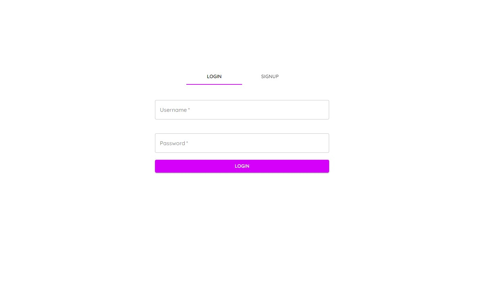
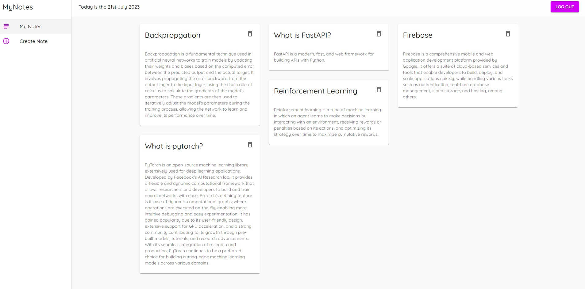

# My Notes
My Notes is a multi-user application designed for creating and storing notes. It provides an intuitive interface for users to organize their notes in a unified place. The application is built using React JS with MaterialUI for a beautiful user interface, NodeJS for the backend API, and JSON Web Tokens (JWT) for secure user authentication.

## Featurees
* Signup Page: New user can signup to user the application.
* Login Page: Secure user authentication using JWT.
* Home Page: Main interface where users can access all their notes.
* Create New Notes Page: Users can quickly and easily create new notes.

## Technologies Used
* ReactJS: A JavaScript library for building user interfaces.
* Material UI: A widely-used React UI framework for crafting beautiful user interfaces.
* NodeJS: A JavaScript runtime built on Chrome's V8 JavaScript engine, used for server-side development.
* JWT (JSON Web Tokens): A standard for securely transmitting information as a JSON object. It is used for authentication and information exchange.
* MongoDB: A source-available cross-platform document-oriented database program, classified as a NoSQL database program.

## Project Structure
This project has the following file structure:
```
/
├── MyNotesAPI/
│   ├── data/
│   ├── public/
│   ├── src/
│   ├── app.js
│   └── package.json
├── screenshots/
├── src/
├── .gitignore
├── README.md
├── package-lock.json
└── package.json
```

* /: This is the root directory that contains all the files.
* MyNotesAPI/: This directory contains the backend NodeJS application.
* data/: This directory stores the JWT tokens in local storage.
* public/: This directory contains static files and images.
* src/: This is the source directory where the actual application code resides.
* app.js: Entry point for the Node.js backend.
* package.json: Specifies the Node.js backend dependencies.
* screenshots/: This directory includes the screenshots of the application.
* src/: This is the source directory for the React frontend.
* .gitignore: This file tells git which files it should not track or maintain a version history for.
* README.md: A markdown file containing information about the project and guidelines on how to use it.
* package-lock.json: This is an automatically generated file that is used to specify the exact version of the installed npm dependencies of the project.
* package.json: This file contains metadata about the project, such as the project's dependencies and scripts for the React frontend.

## Getting Started
To set up this project locally, you should have NodeJS, npm and MongoDB installed. If not, you can download them from here:
* Node.js and npm: https://nodejs.org/en/download/
* MongoDB: https://www.mongodb.com/try/download/community

## Installation
1. Clone the repo
```
git clone https://github.com/niranjanblank/MyNotes
```

2. Install NPM packages
```
cd MyNotes
npm install
```

3. Download and run MongoDB service
4. Run the backend application
```
cd MyNotesAPI
node app.js
```
5. In a seperate terminal, run the frontend application.
```
npm run start
```
6. Open your browser and navigate to http://localhost:3000 . You should see the following page:


7. Register username and password by selecting signup tab

## Home Page

8. Login using the username and password from login page


9. You can create notes from create note page


10. You can see all the notes from mynotes page


